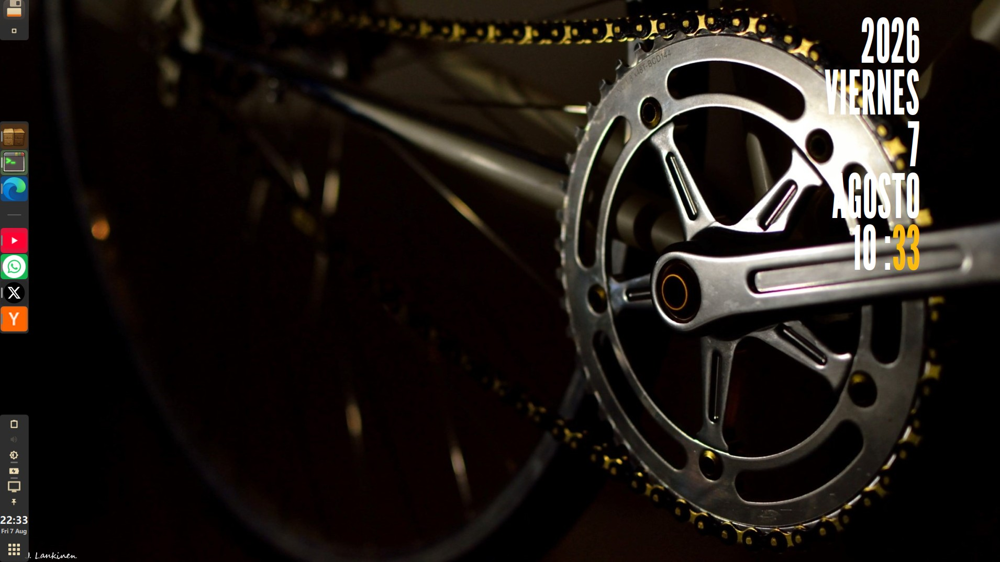

[Español](README.md) | **English** | [中文](README.zh-CN.md)

# kdock  ·  RELEASE 0.5.0



*Kdock configuration example*

**Dock and panel for Wayland desktops**, written 100% in Qt 6.

[](https://github.com/yacolinux/kdock/actions/workflows/ci.yml)
[](LICENSE)


kdock **does not link against KDE Frameworks or Plasma**. Wayland protocols are generated
directly from their XML with `qtwaylandscanner`, and everything else is resolved over D-Bus
or the CLI. The result is nine standalone binaries, no plugins to install, and no need to
drag half of Plasma along as a dependency.

Used daily on **KDE Plasma 6 / KWin**; the taskbar also works on wlroots compositors (sway,
hyprland, wayfire) via `wlr-foreign-toplevel-management-v1`.

---

## Gallery

The dock, across different edges and label layouts:

| | |
|---|---|
| <br>*Left, compact, icons only* | <br>*Left, label to the side* |
| <br>*Same, with the icon/label order reversed* | <br>*Right, with the widgets at the bottom* |
| <br>*Top, label to the side* | <br>*Top, compact, label above* |
| <br>*Bottom, edge to edge, label under the icon* | |

## Features

### The dock

- **A real compositor panel** via `wlr-layer-shell-v1`, with an *exclusive zone* (the
  Wayland equivalent of X11 struts) so maximized windows never cover it. The layer-shell
  integration is our own code, compiled as a static Qt Wayland plugin (`src/layershell.cpp`);
  dialogs and menus are delegated to xdg-shell on their own.
- **Taskbar** with two backends chosen at runtime: `org_kde_plasma_window_management`
  (KWin) and `wlr-foreign-toplevel-management-v1` (wlroots).
- **Pinned launchers** from hand-parsed XDG `.desktop` files, with window grouping per
  application (including **Chromium/Edge web apps**, which report a mangled `app_id` and
  need their own heuristics).
- **Selectable apps**: the applications block can be repeated several times, with an independent
  launcher list per instance. Each one can show only pinned apps, exclude apps already assigned to
  another widget or dock on the monitor, and ungroup windows. It can also be refreshed manually
  from its context menu or Settings.
- **One dock per monitor**, opt-in: each with its own independent configuration (edge,
  size, widgets, pins) and hotplug handling. Up to 6 docks per screen.
- **And different docks per virtual desktop** (KDE/KWin): besides varying from monitor to
  monitor, a dock can be tied to one or several desktops. The rule is per monitor: on a
  desktop that has docks of its own, you see **those and only those**, and a monitor with no
  desktop-specific docks keeps showing its regular ones. So as long as you don't tie any
  dock, nothing changes: the current docks show on every desktop, same as before. It's
  configured from *Docks*, by checking desktops or with **Duplicate for desktop…**, which
  clones the dock on the same monitor as a starting point to differentiate it. And from the
  right-click menu, **Dock → Create empty dock** adds one with default values on the same
  monitor: if the desktop you're on already has its own docks, the new one gets tied to it so
  it shows up immediately. **Dock → Move to next monitor**, also from the right-click menu,
  moves the dock to the next connected monitor (wrapping around at the last one): the
  configuration travels with it and the old file is kept renamed as a backup, cleaned up
  automatically on the next move. Right below it, **Dock → Copy to next monitor** does the
  same but **leaves the original alone**: the dock stays where it is and the next monitor
  gets an identical copy, ready to be told apart. The only things a copy does not inherit
  are the name and — when both will be on screen at once — the system tray, which would
  otherwise be drawn twice. At the top of the dialog, a **desktop** selector and the
  dock's **name** always show which one you're editing; opening Settings from a dock
  preselects its own. Docks on a desktop **are not built until the first time you enter it**
  —so you don't pay the memory cost of a dock you'll never see— and from then on switching
  desktops just shows and hides them.
- **A different wallpaper per virtual desktop**, which Plasma doesn't offer: its wallpaper
  belongs to the screen, not the desktop. kdock achieves this by rewriting it at the moment
  of the switch. **Desktop 1 is still KDE's**: its configuration —the slideshow with its
  folders and intervals, or whatever you have— saves itself and comes back whenever you
  return to it, and also when kdock quits. Desktops 2 to 5 each carry **their own mode**:
  *Static* (a fixed image per monitor, KDE's file dialog, the one that previews images) or
  *Slideshow* (KDE's plugin rooted at **one folder per monitor**, with a configurable
  interval in seconds, 5 minutes by default). Modes are **mutually exclusive per desktop**:
  one can run a slideshow while another shows a fixed image. A monitor you don't assign
  anything to is left untouched. It ships **off**: until you turn it on, kdock doesn't write
  a single key to your desktop.
- **Four hide modes**, in Settings → General: *Always visible* (reserves the space, windows
  never cover it), *Hide when not in use* (the auto-hide of old: it slides away and comes back
  on hover), **Intelligent hide** (stays out while nothing bothers it and hides only when a
  window reaches its rectangle — Latte's *dodge*) and **Windows go below** (always visible but
  without reserving space, so a maximized window uses the whole edge and runs underneath).
  The last three ask for no *exclusive zone*, so they don't shrink your maximize area.
  Intelligent hide only looks at windows on the **current virtual desktop** and ignores
  minimized ones; with center alignment it dodges on the whole edge band, because on Wayland it
  is the compositor — not the client — that decides where a centered surface lands.
- **Presentation modes**: floating or edge-to-edge panel, compact mode, start/center/end
  alignment, opacity, background color, fixed or automatic length.
- **Quick colors**: eight configurable background colors, applicable on the fly from the
  right-click *Background color* submenu. The palette is **shared across all docks** and
  lives in the shared configuration, so it's edited once and survives restarts; the chosen
  color, on the other hand, is per dock.
- **Icon labels** in six layouts (below, to the side, name only…) with measurement of the
  longest name so the dock doesn't waste thickness. Optionally **bold**, with
  re-measurement so the widest name still fits.
- **Two-line names** (optional): a name longer than its box **wraps** instead of being
  truncated with an ellipsis, so it reads in full — *Made-up Application Name* instead of
  *Made-up Applicat…*. It applies to both app and widget names, and the dock's thickness
  follows the change: the box grows to two line-heights and the layer-shell *exclusive zone*
  is recalculated, so maximized windows stay uncovered.
- **Dark mode** toggleable per dock, or for all at once with an exception list: dark
  background, a single highlight color for names and running apps, and widget icons
  resolved against the dark set. It's an **override**, not a rewrite: the color scheme you
  already had stays intact in the `.conf` and comes back exactly as it was when you switch
  back to Normal. It's changed from its tab, from the right-click *Mode* submenu, or from its
  own widget. It can optionally drag along the **KDE color scheme and iconset** as well as
  the dock's own iconset: since that is desktop state and can't "stop being applied," each
  option stores the value for both modes.
- **ColorAuto**: a **KDE color scheme generated from the wallpaper**, rebuilt every time the
  wallpaper changes. It pulls the image's predominant color with the same cheap method the
  dock already uses to tint an icon, and builds a full scheme out of it — but unlike most
  tools of this kind, **contrast wins over color**: every piece of text and every button is
  pushed until it meets a WCAG ratio against whatever it sits on (AAA for body text), so the
  result stays readable whatever the photo is. The selection color is chosen separately and
  defaults to whatever contrasts best: a dark gray with white text on light schemes, a light
  gray with black text on dark ones — or a color of your own, or the wallpaper's complement.
  Light or dark is decided by the image's mean luminance, with the option to force it. The
  **docks are colored per monitor**, each from its own wallpaper, and like dark mode it is an
  override: your panel color stays untouched and comes back when you switch it off. The
  **system scheme** is a single one and follows whichever monitor you pick (by default, the
  same one the brightness wheel drives). The generated scheme is **temporary**: it is
  rewritten on every change and removed when the option is turned off. And it gets along with
  dark mode: while that one is on, ColorAuto stands aside and comes back on its own when you
  leave. Configured in its own tab, once for every dock.
- **Neon glow** around dock panels, with monitor selection, intensity and size controls. It offers
  an inner rim or an outer halo that stays outside the input area and avoids spilling onto a
  neighboring monitor; it can follow dark mode and be disabled per dock.
- **"Generate color" by hand**, which works with ColorAuto switched off: from its own tab, from
  a dock widget (left click generates, right click opens the settings) or from the control
  panel's card. Pressing it again on the same wallpaper **moves to that image's next color** —
  candidates are kept apart by hue, so every click shows — and you can keep trying until one
  looks right. When one does, **Save color scheme** keeps it permanently in your schemes folder
  as `kdock-1`, `kdock-2`… and applies it: from then on it is yours, and neither switching
  ColorAuto off nor restarting the dock overwrites it.
- **Auto-shrink**: when not all icons fit, the dock reduces scale and font instead of
  clipping.
- **Drag & drop** to reorder icons and whole sections.
- **Five kinds of separator**, and no two are drawn alike. Between sections, from any widget's
  right-click menu: the **dynamic** one (*spring*), which stretches and pushes the rest toward
  the other end; the **static** one, a fixed gap with a thin line; and the **transparent** one,
  which also cuts the dock background and its input region — the desktop shows through and
  clicks pass, so one dock reads as two. The transparent one can also be **pinned to a width**,
  one per separator (*Layout* tab): it then stops distributing the leftover room and measures
  exactly the pixels you give it, which is how you split a dock into two blocks side by side
  instead of pushing them to the edges. And **inside the applications block**, up to two more
  (*Layout* tab), splitting the pinned launchers from each other and from the merely running
  windows: each one can be a line or **transparent**, i.e. blank room with no line, the dock
  background left painted behind it.
- **Sending windows to another virtual desktop** from an app icon's right-click menu:
  *Desktop → Window here* brings it to the current desktop, and *Send to…* sends it to
  another one **without following it** — you stay where you are. It moves all of that app's
  windows, same as *Close all*.
- **System icons and colors**: `QIcon::fromTheme` + color scheme read from
  `~/.config/kdeglobals` with live reload. The background of running apps is tinted with the
  dominant color of its own icon.
- **A single theme picker**, in both the dock and the settings: a full install has ~180
  iconsets and ~450 color schemes, so instead of a dropdown with that wall of names, each
  picker opens a list **with a search box and preview** — three sample icons rendered *in
  that* iconset, or three color swatches from the scheme. Each row has a **favorites**
  checkbox that pins it to the top; favorites are a single list shared by every dock and by
  the dialog. And a **"Keep open"** checkbox to try themes one after another without
  reopening the window on every change.
- **System tray** (StatusNotifierItem + DBusMenu, implemented in-house). It goes on whichever
  dock you choose —any one, not just the main one— though only on one at a time: two visible
  trays would duplicate every icon. Docks that never appear together, on the other hand, can
  each have their own, so a virtual desktop with its own docks doesn't end up without a tray.
- **Hover previews** for application icons: a window capture appears above an open app and offers
  individual minimize, maximize and close buttons. It is optional and uses the KWin screenshot
  permission described below.
- **Built-in screensaver**: activate it after idle time, on selected monitors or on all monitors,
  using either the configured wallpaper slideshow or After Dark CSS animations. A local checkout
  can be selected for offline use, and the overlay may cover visible docks.
- **Widgets-only docks**: turning off app icons (General → *App icons*), a dock becomes a
  bar of widgets, tray and its own launchers, and shrinks to fit whatever's left.
- **Keyboard layout under Wayland** (*Modo QT* tab). Under Wayland the key map is compiled by
  the compositor, and when that compositor is KWin it takes it from `kxkbrc`, **ignoring**
  `/etc/default/keyboard` and whatever `lxqt-config-input` applies (which uses `setxkbmap`,
  i.e. X11). The classic result: every system file says `latam` and the keyboard types as
  Spanish from Spain, with no way to move it from the control centre. kdock writes that file
  and sends KWin the KConfig notification, which is the only thing that makes it recompile the
  map **live** — KWin's `reconfigure` does not do it. You pick layout, variant, model and xkb
  options from `evdev.lst` (the same list the KDE and GNOME panels read), and kdock re-applies
  it on every start, so the choice survives a login. Off by default, and inert while off.
- **Global tooltips**: a checkbox in *General* turns all tooltips on or off across every
  dock at once, so you don't pay for their windows if you don't want them.
- **Settings panel** in Qt Widgets, with one tab per area, each tinted a different color so
  you can find your way at a glance (that's what you see in the screenshot above). The
  *Docks* tab lists every dock you have configured —each with its monitor, edge and
  desktops— and lets you rename them with a double click; the alias is appended to the
  automatic name, so the monitor is never lost. By default it hides docks and monitors that
  aren't connected, with a checkbox to show them again.
- **Application menu** in Kickoff style: XDG categories, search, favorites and a session
  footer. It also shows **its own submenus**: the ones built with KDE's menu editor and the
  ones browsers create for their web apps — declared in XDG `.menu` files, which list their
  members by file name rather than by category (in fact, web apps' `.desktop` files carry no
  `Categories` at all). Right-clicking the menu button opens the menu editor, which is
  configurable. **Every row in the sidebar has an icon**, both freedesktop categories and
  the app's own submenus, with fallbacks in case the chosen icon set is missing one of the
  standard names.
- **List or grid view** in the menu, from 1 to 8 columns, with adjustable icon size and
  spacing: cells are computed from the icon, so a handful of apps don't sprawl across the
  whole popup.

#### Translatable interface, in text files

The strings written into the code are the **native layer, "capabase"**. On top of it a
translation is loaded: a plain-text `.md` file in `~/.local/share/kdock/translations/`,
chosen and edited from the *Translations* tab of the settings panel (the **Edit** button →
opens with your default text editor; on save, the dock picks up the changes on its own, no
restart needed). It ships with **Spanish**, **English** and **Simplified Chinese (zh-CN)**,
with more languages to come.

Each file has four sections:

| Title | What it translates | Key |
|---|---|---|
| `Configuracion` | The settings panel | the capabase text |
| `UIdock` | Dock menus, tooltips and popups | the capabase text |
| `Widgets` | Widget names | the widget's token (`clock`, `pager`…) |
| `Apps` | Application names | the `.desktop` id |

Whatever a translation doesn't include falls back to the capabase text — and for apps, to
the `Name=` field of their `.desktop` — so an incomplete file is perfectly valid: translate
whatever you want and the rest keeps working. A widget you've **renamed by hand** keeps that
name in every language. The *Refresh apps* button fills the `Apps` section with every
installed application, ready to rename, and *New…* duplicates a translation as a starting
point for your own: that's all it takes to add a language, no recompiling needed.

Chinese requires a CJK font installed (Noto Sans CJK or WenQuanYi); without it the system
draws tofu boxes, and that's not something kdock can fix.

There are also nine **ALT** layers, with names swapped for nicknames: three sets —
`*-ALT-startrek` (Star Trek ships), `*-ALT-hacker` (hacker handles) and `*-ALT-starwars`
(Star Wars hardware) for the widgets— across three base languages, `english-`, `spanish-`
and `zh-CN-`. All nine share the same cast for the `Apps` section: AIs from science-fiction
novels and fictional hacking tools. In English and Spanish the nicknames are proper nouns
and stay as-is; **in Chinese they're translated too** (冬寂 Wintermute, 企业号 Enterprise,
匡氏十一型 Kuang Mark Eleven), which is how the joke reads in the interface's own language.
They also work as a complete example of all four sections — especially `Apps`, the only one
filled with real `.desktop` ids.

| | Star Trek | Hacker | Star Wars |
|---|---|---|---|
| Disks | Reliant · 可靠号 | Phantom Phreak · 幽灵飞客 | Astromech · 宇航技工机 |
| Network | Excelsior · 卓越号 | Phiber Optik · 光纤客 | Comlink · 通讯器 |
| Volume | Intrepid · 无惧号 | Blade · 利刃 | Sonic Emitter · 声波发射器 |
| Dark mode | Equinox · 春分号 | Nightfall · 夜幕 | Carbonite · 碳素冷冻 |

And in the `Apps` section, the same across all nine: Dolphin is *Wintermute* (冬寂), Konsole
*Mycroft Holmes* (迈克罗夫特), Edge *Kuang Mark Eleven* (匡氏十一型) — the icebreaker from
*Neuromancer* —, Wireshark *Packet Ripper* (数据包撕裂者). In total there are **thirteen
layers**: capabase, the three languages, and the nine ALT ones.

### Widgets

All optional and reorderable. The backends talk D-Bus or the CLI directly, never KDE
Frameworks:

| Widget | What it does | Backend |
|---|---|---|
| Selectable apps | The apps block as a repeatable section, with its own launcher list: one dock can hold **several**. Per-instance filters — *Show pinned only*, exclude apps pinned in other widgets or on the monitor, and *Ungroup windows* — plus manual reload make it useful for catch-all blocks without duplicates | Compositor protocol |
| Volume | Default sink: scroll, mute, level | `wpctl` / `pactl` (PipeWire) |
| Brightness | Screen brightness | `brightnessctl` |
| Battery | Charge, status and power profile | UPower + power-profiles-daemon |
| Disks | Removable drives: mount, unmount, eject, open | UDisks2 |
| Network | A small window with three tabs: **Wi-Fi** (nearby networks, join with password), **Saved** and **Details** (IP, netmask, gateway, DNS, MAC, IPv6). A *Configure networks…* button opens the full editor | NetworkManager |
| Weather | Condition icon and temperature; the click opens the forecast mini-app. Several saved cities, one of them current | Open-Meteo (HTTPS, no API key) |
| Clipboard | Text and image history with search, persistent, captured in the background | `ext-data-control-v1` |
| KDE iconset | Changes the icon set for the whole desktop, leaving the dock's own untouched | `plasma-changeicons` |
| Color scheme | Applies a KDE color scheme to the whole desktop | `plasma-apply-colorscheme` |
| Clock | 12/24 h, date, seconds (two variants) | — |
| Overview | Opens KWin's Overview effect | kglobalaccel |
| Move window | To the next virtual desktop, or the next monitor (right-click: previous) | kglobalaccel |
| MaxMin | Maximizes (left click) or minimizes (right click) the active window | kglobalaccel |
| Close window | Closes the active window; right-click sends it to the next desktop without switching desktops | Compositor protocol + KWin (D-Bus) |
| Next wallpaper | Advances a monitor's wallpaper slideshow | Plasma D-Bus |
| Session | Log out, restart, shut down, lock, suspend | KDE D-Bus |
| Show desktop | "Show desktop" toggle | Compositor protocol |
| Desktops | Minimal pager: one number per virtual desktop, click to switch; the current one is highlighted | KWin (D-Bus) |
| Auto-hide | Turns auto-hide on and off (the other two modes are picked in Settings) | — |
| Dark mode | Left click: normal scheme; right click: dark mode | — |
| Sub-launchers | Nested mini-dock: an icon opens a bar with other launchers | — |
| Script Runner | Runs a configurable shell script | `sh` |
| Tile menu | Opens and closes the fullscreen menu | `kdock-tilemenu` (D-Bus) |
| Control Manager | Opens the control panel: audio, per-monitor brightness, power, calendar, playback, network, weather, wallpapers and system. Can draw its own text (or the clock) on the dock, with its own font | `kdock-controlmanager` (D-Bus) |
| Screensaver | Covers selected monitors after an idle period; wallpaper slideshow or After Dark CSS scenes | Wayland idle + Qt WebEngine |

### `kdock-previews` (companion binary)

**Window preview strips** on a screen edge — one card per window with a real capture of its
content, click to activate it (the reference is macOS's Stage Manager). It's a second binary
with its own tree (`previews/`), its own configuration and its own multi-monitor handling; it
runs *alongside* the dock, which only turns it on, turns it off, and opens its panel from
*Settings → Previews*. It uses `org.kde.KWin.ScreenShot2`, so it's **KWin only**.

- **Clicking a card** = focus toggle like a taskbar: it restores and focuses the window, and
  a second click on the one already in front minimizes it. Middle click = close.
- **Card auto-fit**: with many windows, cards shrink to fit the length of the strip instead
  of overflowing into a scrollbar, and return to their configured size when windows close
  (with an adjustable minimum size). The **strip's thickness follows the cards**: the strip
  gets thinner as they shrink and recovers its size as they grow, so thumbnails always fill
  the strip with no empty band on the sides (and the desktop's reserved area follows along).
- **Scrolling**: mouse wheel, inertial drag and *fling* tuned for moving between large cards
  effortlessly, plus an optional thin scrollbar on the strip's inner edge.
- **Size and placement**: any of the four edges, adjustable thickness from 48 to 800 px (the
  panel calls it *height* or *width* depending on the edge), fixed or edge-to-edge length,
  and start/center/end alignment — which moves the strip if it has its own length, or the
  cards within it if it fills the whole edge.
- Captures **one per window as it comes to the foreground** (or periodic refresh,
  experimental), filters by monitor / virtual desktop / minimized, and optional auto-hide.

### Dock hover previews

Hovering an open application icon in **Apps** or **Selectable apps** shows a **frameless mini
window** with that window's capture. It has individual minimize, maximize and close buttons and
stays visible while the pointer is over it. On KWin it requires the screenshot permission below.

### `kdock-tilemenu` (companion binary)

**Fullscreen application menu**, with icons in a grid that rearranges itself by dragging
them (the reference is Plasma's Tiled Menu applet, hence the name). It's a third binary with
its own tree (`tilemenu/`), its own configuration and its own panel; it's turned on and off
by the dock's *Tile menu* widget.

It takes up **all the free desktop: everything except visible docks and panels**, whatever
edge they're on and whichever ones they are. There's no geometry code needed to achieve
this — the window is a normal, *maximized* toplevel, and the compositor already knows how
to subtract the space panels reserve. A dock with auto-hide comes for free the same way: the
menu covers the whole screen and the dock draws on top when it appears.

- **Each section remembers its own layout** — Favorites, "All", every category and every
  `.menu` submenu. They start out sorted alphabetically on their own and become yours as
  soon as you drag the first tile. That's the difference from the reference applet, where
  only the pinned canvas can be arranged by hand.
- **Tiles in several sizes** (1×1, 2×1, 1×2, 2×2, 4×2, 4×4), each with its own color or
  background image, and with icon and name optionally shown separately — plus the ability
  to rename it or change its icon without touching the `.desktop` file. Names are bold by
  default, toggleable from the panel.
- **Groups as tabs**: each section can be split into named groups, which appear as a tab bar
  above, below or to one side (your choice), and only when there's more than one. A tile
  moves to another group **by dragging it onto its tab** or from its context menu → *Move to
  group*, which also offers creating a new group with that tile in it. The settings panel
  includes a group editor —one section at a time— to create, rename, reorder and remove
  them.
- **Nothing odd happens on drop**: if the cell is free, it goes there; if a tile of the same
  size occupies it, they swap; any other case is rejected and the tile returns to its place.
  Nothing rearranges itself just because you moved a neighbor, and a colored ghost tells you
  which of the three cases applies *before* you drop.
- **Search box**, side **alphabetical index** (in sections you haven't arranged by hand), a
  category bar —with an icon on every row— on the left or right, or hidden; a session row,
  and keyboard navigation.
- **Keep open**: a checkbox in the corner that disables all four automatic-close paths (Esc,
  the ✕, losing focus, launching an app). With it on, the menu behaves like any other
  window, which can be sent to the back and brought back with alt-tab.
- The layout is **a single one for the whole session** —every dock opens the same menu— and
  it's exported and imported as JSON.

It launches on the widget's first click and stays resident, so subsequent openings are
instant. Unlike `kdock-previews`, it **needs no special KWin permission**.

### `kdock-calendar` (companion binary)

**Standalone month calendar**, meant to be opened from the clock widget (the clock's click
can point to this binary, and a second click closes it) or from a Script Runner. The clock
widget itself is untouched: this is a separate normal toplevel, with no configuration of
its own.

- **KDE look with large numbers**: **Monday-first** week, local date, **current day
  highlighted** in a pill with the accent color, ring selection, and days from other months
  / weekends dimmed. The 7×6 grid takes up all the available space and the numbers scale
  with the cell, so it grows well in large windows.
- **Hand-painted in Qt Widgets** (no QML or KDE Frameworks): uses the system palette, so it
  follows the light/dark theme and the KDE accent color automatically.
- **Navigation**: ‹ › arrows in the header, mouse wheel, `PageUp`/`PageDown` and a **Today**
  button to return to the current month. The footer shows the long date of the selected day.
- **`kdock-calendar --month YYYY-MM`** starts on another month (current month by default).
- Just like `kdock-tilemenu`, it **needs no special KWin permission**: it runs directly from
  `build/` and its `.desktop` only provides the name and icon in the task manager.

### `kdock-controlmanager` (companion binary)

**Control panel anchored to a screen edge** — the one place to see and touch everything at
once: audio, per-monitor brightness, power profile, dark mode, calendar, playback, network,
weather, wallpaper and system. With its own tree (`controlmanager/`), its own
configuration and its own settings dialog; the dock's *Control Manager* widget opens and
closes it.

- The first tab (**Principal**) is a **grid of cards** that rearrange and resize by dragging
  (1×1…6×3, each with an optional background color), and every section also has its own full
  tab — **the same card at both sizes**. Grid cells can be taller than wide, so cards are
  configured in both width and height.
- **Audio**: the full mixer — outputs, inputs and per-app streams, with default device, mute
  and the 150 % ceiling.
- **Video and power**: a brightness slider **per monitor** (PowerDevil), the energy profile
  and the dock's dark mode, live over D-Bus.
- **Calendar**: navigable month, with a button to open `kdock-calendar`.
- **Playback**: cover, title/artist, progress bar and transport for any MPRIS2 player.
- **Network**: the same as the dock's widget, tab for tab — nearby networks (with the password
  row to join one), saved connections, and the connection's own data (IP, netmask, gateway,
  DNS, MAC).
- **Weather**: current conditions, an N-day forecast and the details, on the same configuration
  the dock widget and the mini-app use.
- **Wallpaper**: advances each monitor's slideshow.
- **System**: the four settings dialogs (KDE, kdock, tile menu, previews), the restarts and
  the labelled session row (lock, suspend, log out, reboot, shut down).
- **Appearance**: background (theme / own color / image), opacity, rounded corners, bold,
  **one font size for the whole panel**, its own icon set, minimum button size and the tab
  bar position. The panel is **resized by dragging its corners**, like a standard window.
- Closes with Esc, the ✕ or on focus loss — all disabled by **Pinned window**, which leaves
  it as a fixed panel.

Like the dock, it is a layer-shell surface: **it needs no special KWin permission**, its
`.desktop` only provides the name and icon, and no application index refresh is needed.


### `kdock-weather` (companion binary)

**The weather, in a window of its own**: place, big temperature, condition icon, a wind arrow
with its speed, and two tabs below — **N days** (day, icon, chance of rain, high and low) and
**Details** (feels-like, dew point, humidity, pressure, gust, visibility, sunrise and sunset).
It is opened by the dock's *Weather* widget, by the panel card's button, or by running
`kdock-weather`.

- **Data comes from [Open-Meteo](https://open-meteo.com)**: HTTPS and JSON, **no API key and no
  sign-up**. Its city search is part of the same service, so kdock ships no list of places: you
  type a name and pick from the results (with region and country, which is what tells apart the
  six cities that share a name).
- **Several saved cities, one current.** The current one is what the dock widget and the panel
  card show; changing it in the mini-app reaches the other two surfaces with no restart.
- **Units are yours**: °C/°F and m/s, km/h or mph. Everything is requested in the provider's own
  units and converted when drawing, so switching is instant and costs no request.
- **It shows what it last knew and asks afterwards.** The response is cached on disk, so the
  widget has a temperature in its very first frame after a dock restart. If the network drops it
  does not blank out: the old reading is dimmed, the footer says so, and it retries with a
  growing backoff.
- **Configurable font size**: the whole window scales with it — icons follow the text — and the
  window grows so nothing gets clipped. Set it in its own dialog or from the dock's
  *Settings → Fonts*, which gathers the typography of all three surfaces.
- **Single instance but not resident**: the widget's click opens it and the next one closes it,
  and closing quits the process. Like `kdock-tilemenu` and `kdock-calendar`, **it needs no
  special KWin permission**.
- With no city configured the dock widget **still shows up**, with a generic icon: the click
  takes you straight to picking one.

---

### `kdock-desktop` (companion binary)

**Full-screen desktop-widget canvas**: one transparent layer-shell surface per monitor, below
normal windows and the dock. It reuses the `kdock-controlmanager` cards, stores its own layout in
`desktop.conf`, starts for connected monitors, and needs no special KWin permission.

### `kdock-systray` (companion binary)

**System-tray host** for StatusNotifierItem and DBusMenu. It is a resident process that collects
the session's items and shows its own layer-shell window; the dock's `systray` widget only toggles
that window. Its configuration is separate (`systray.conf`) and it prevents duplicate trays across
visible docks.

### `kdock-setwallpaper` (companion binary)

A windowless **set-as-wallpaper helper** for Dolphin and PCManFM-Qt's “Open with” menu. It uses
the running dock under LXQt and Plasma as a fallback, and accepts `--screen <connector>` to select
the monitor. It needs no special KWin permission.

## Requirements

**To build** — just Qt 6 (≥ 6.5) and CMake/Ninja:

```sh
sudo apt install qt6-base-dev qt6-declarative-dev qt6-wayland-dev \
                 qt6-wayland-private-dev qt6-webengine-dev cmake ninja-build
```

Qt modules: Core, Gui, Qml, Quick, Widgets, DBus, **Network** (weather only), WebEngineWidgets
(screensaver) and WaylandClient (plus WaylandClient's private headers, needed by the layer-shell
integration). At runtime you need **two QML
modules**: `QtQuick.Controls` and `Qt5Compat.GraphicalEffects` (package
`qml6-module-qt5compat-graphicaleffects` on Debian/Ubuntu, `qt6-5compat` on Arch), used for
the shadows in the dock and the preview cards. **Without the second one the dock does not
start**: the QML fails to load and the window comes up empty.

**At runtime**, every dependency is optional and only disables its widget if missing:
`wpctl` or `pactl` (volume and mixer), `brightnessctl` (brightness), UDisks2 (disks),
NetworkManager (network), UPower (battery). The weather is the only thing that goes out to the
internet, and only once you configure a city. The Overview, move-window and next-wallpaper
widgets only show up under KDE.

## Tests

```sh
tests/run.sh                 # static + unit + qml (~1 min), the same thing CI runs
tests/run.sh --tier live     # plus the ones that need your Wayland session and KWin
```

Four ctest tiers: **static** (repo invariants: qmllint, every `.qml` declared in the qrc,
the translation catalogue up to date), **unit** (Qt Test against the very objects the dock
is built from), **qml** (the real binaries under Xvfb: the QML loads *and* draws — the
window geometry is checked too, because a silent log is also what you get when the QML was
never instantiated) and **live** (intelligent hide against real windows, and multi-monitor:
both need a compositor, which is why they stay out of CI).

Every run gets a throwaway `XDG_DATA_HOME` and fake system tools in `PATH`, so it **will not
touch your brightness, theme or configuration**. Details in [`tests/README.md`](tests/README.md).

## Build and install

```sh
cmake -B build -G Ninja -DCMAKE_BUILD_TYPE=Release
cmake --build build -j
sudo cmake --install build     # installs the nine binaries and their .desktop files
```

To run the complete cycle, including refreshing the tray host and orderly restarting Kdock
and its accessories, use:

```sh
tools/install-and-restart.sh
```

The script uses Kdock's D-Bus service names as the session contract. The tray is normally kept
alive across an ordinary restart, but is recycled during installation so it cannot keep the
previous executable mapped.

> If your environment exports `CC="ccache gcc"` / `CXX="ccache g++"`, CMake's AutoMoc fails:
> configure with `env -u CC -u CXX cmake …`.

## Releases

Release `0.5.0` is prepared as source-only for now. The GitHub Actions workflow runs when a `v*` tag is pushed
and attaches two reproducible source archives: `kdock-<version>.tar.gz` and
`kdock-<version>.zip`. They contain no compiled binaries or user configuration.

To create them locally from a commit or tag:

```sh
tools/make-source-archives.sh v0.5.0
```

Creating the tag and publishing the GitHub release remain explicit maintainer steps; normal builds
do not publish anything automatically.

## KWin permissions (important)

KWin treats the window list and captures as **privileged interfaces**, and only grants them
to a process whose **installed** `.desktop` declares them. It resolves `/proc/<pid>/exe`
against that file's **absolute** `Exec=`, which is why CMake generates it at install time:

```ini
# kdock.desktop — needs both
X-KDE-Wayland-Interfaces=org_kde_plasma_window_management
X-KDE-DBUS-Restricted-Interfaces=org.kde.KWin.ScreenShot2

# kdock-previews.desktop — needs both
X-KDE-Wayland-Interfaces=org_kde_plasma_window_management
X-KDE-DBUS-Restricted-Interfaces=org.kde.KWin.ScreenShot2
```

After installing you need to refresh the index so KWin can find the `.desktop` files:

```sh
kbuildsycoca6
```

`kdock-tilemenu` isn't listed here because it doesn't request anything privileged: it can be
run from anywhere, with no `.desktop` and no index refresh. The same applies to
**`kdock-calendar`**, **`kdock-controlmanager`**, **`kdock-desktop`**, **`kdock-systray`** and
**`kdock-setwallpaper`** (their interfaces are public or use the session bus only).

If you run `kdock` or `kdock-previews` from a different path during development,
copy the `.desktop` to `~/.local/share/applications/` with `Exec=` pointing to *that*
binary's absolute path. Without this the dock still starts, but with no window list; and
`kdock-previews`, without the second key, leaves every card with the app's icon instead of
the capture — looks like a rendering bug and is actually authorization.

Nothing is needed on wlroots compositors: `zwlr_foreign_toplevel_manager_v1` is public.

## Usage

```sh
kdock
```

- **Left click** — launch / focus / minimize / cycle through windows.
- **Middle click** — new instance.
- **Right click** — context menu: window list, pin/unpin, close, labels, background color,
  add separator, settings. Every entry carries its icon, **submenu headers included**
  (*Desktop*, *Location*, *Background color*, *Mode*, *App text*, *Widget text*, *Dock*).
- **Drag** — reorder icons and sections.

On widgets, right click opens that same menu, except for the ones that use it for a second
action (volume → mixer, move to monitor → previous monitor, MaxMin → minimize, close window
→ send it to the next desktop). On all of them, **Shift + right click** opens the menu.

The configuration lives in the XDG data directory:

```
~/.local/share/kdock/
  kdock.conf                  # shared options (sub-launchers, script runners, theme,
                              #   iconset and color scheme favorites…)
  kdock-<monitor>[-<n>].conf  # one file per dock
  previews.conf               # kdock-previews (shared + one per screen)
  tilemenu.conf               # kdock-tilemenu: options and tile layout
  desktop.conf                # kdock-desktop: canvas and cards
  systray.conf                # kdock-systray: resident tray
  weather.conf                # kdock-weather: cities and units
  clipboard-history.txt
```

*Settings → Presets* saves all of that as a named preset (`presets/<name>.zip`), applies one
in a single click — it replaces the `.conf` files and restarts kdock with its accessories —
and exports or imports it as a `.zip`.

### Example Script Runners (`scripts/`)

The *Script Runner* widget runs any shell script: the example collection lives in
[`scripts/`](scripts/), with no private data or hardcoded paths. Both advance Plasma's
**wallpaper slideshow** using the configuration each monitor already has (they don't write
folders):

- **`scripts/next2.sh`** — advances the slideshow **only** on the monitor of the dock that
  launched it (the click exports `KDOCK_SCREEN`; it resolves the monitor by geometry via
  `wayland-info`).
- **`scripts/next-all.sh`** — advances the slideshow on **all** connected monitors.

They only act on monitors already in *Slideshow* mode (a static image is left alone).
Wire-up: *Settings → Script Runner* → `scriptPath` pointing at the chosen file. Requires
`qdbus6` and `wayland-info` at runtime.

## Performance baseline (RELEASE 0.1)

The dock starts at ~240 MB RSS with the current desktop's set of docks; each additional
virtual desktop adds ~57 MB the first time you enter it (deferred construction), and from
then on RSS is flat — switching desktops only shows and hides, never creates or destroys.

**Popups and tooltips.** Every `ToolTip`, `Menu` and `Popup` with `popupType: Popup.Window`
opens its own `QQuickWindow` with a dedicated `QSGRenderThread` and two Mesa driver threads
per GL context. QtQuick.Controls doesn't release them after closing, so over a several-hour
session with half a dozen docks the process built up to **68 render threads + 136 Mesa
threads** and a **571 MB heap**, with no ceiling. As of this version:

- **Click popups** (the application menu, clipboard, disks, network and theme pickers) are
  loaded on demand with `Loader { active: false }` and destroyed automatically after **30
  seconds of inactivity**, using the pattern measured in `tilemenu/`.

- **Tooltips** remain per-element (original behavior): the attached API that made them share
  a single instance per window was tried and dropped, because it positions the tooltip at
  the cursor (it flickers on horizontal docks) and without a proper parent it falls behind
  maximized windows on vertical docks. Instead, a **global tooltip switch** was added
  (*Settings → General → Tooltips*) that turns them off entirely if they get in the way or if
  the user would rather not pay the memory cost.

The enhanced clock's `ToolTip` keeps its custom design (own contentItem).

**Startup.** A dock only instantiates the widgets it draws: a `Loader` builds its component
even when the section is invisible (`visible: false` only stops the painting), so every switched
off widget used to cost its `Menu`, its `ToolTip` and its icons on every start. And the docks the
current desktop wants are created **staggered**, not all in the same pass of the event loop: the
first one shows up and answers input while the rest are still being built. Building one dock
costs ~0.4-1.5 s depending on how many widgets it carries (measurable with
`KDOCK_DEBUG_STARTUP=1`).

| | Before (11 h / 6 docks) | After |
|---|---|---|
| `QSGRenderThread` | 68 | ~4-6 (one per visible dock window) |
| Mesa threads | 136 | ~8-12 |
| Heap | 571 MB | ~180 MB (estimated) |
| i915 buffers | 529 MB | ~120 MB (estimated) |

## Repository layout

| Path | What it is |
|---|---|
| `src/` | The dock: backends, model, configuration, settings dialog |
| `qml/` | The dock's UI and its popups |
| `scripts/` | Example Script Runners (advance the slideshow on one monitor or on all), no private data |
| `previews/` | Companion preview binary (own tree, reuses 5 files from `src/`) |
| `tilemenu/` | Companion tile-menu binary (own tree, reuses 8 files from `src/`) |
| `calendar/` | Companion month-calendar binary (own tree, self-contained) |
| `controlmanager/` | Companion control-panel binary (own tree, reuses 16 files from `src/`) |
| `desktop/` | Full-screen desktop canvas |
| `weather/` | Companion weather binary (own tree, reuses 5 files from `src/`) |
| `systray/` | Resident system-tray host |
| `setwallpaper/` | File-manager wallpaper helper |
| `protocols/` | Vendored Wayland protocols (layer-shell, foreign-toplevel, plasma-window, xdg-shell, ext-idle-notify) |
| `translations/` | The translation layers (`capabase.md` + one `.md` per language). Copied to the home directory on first run and edited there |
| `tests/` | The test suite: `run.sh` plus four ctest tiers (`static`, `unit`, `qml`, `live`). See `tests/README.md` |
| `.github/` | CI and release workflows: build/test the project and package source archives when a tag is published |
| `tools/` | `gen-capabase.py` (rebuilds `capabase.md` from the code), `sync-translations.py` (propagates new keys to the other languages), `gen-alt-layers.py` (regenerates the nine ALT layers) and `make-source-archives.sh` (packages releases) |
| `screenshots/` | README screenshots. `.gitignore` intentionally ignores `*.jpg`/`*.png` (a desktop capture can show too much): the ones here were reviewed one by one and added with `git add -f` |
| `AGENTS.md` | Architecture document: every widget, Wayland pitfalls, the QML↔C++ table |
| `CLAUDE.md` | How to build, test and install; GUI-less test harnesses |

## Known limitations

- **Wayland is the target.** On X11 the binary runs as a normal window, with no struts or
  reserved space.
- **Enterprise Wi-Fi (802.1X/EAP)**: the network editor covers WPA/WPA2/WPA3-Personal, open
  networks and WEP. An 802.1X connection is shown but can't be saved from here.
- **Clipboard**: saves text and images. Other formats (files, rich HTML) aren't supported.
- **Reserved space isn't per virtual desktop.** KWin computes the maximized area per
  monitor, not per desktop, so if the docks on two desktops reserve different space (a
  different edge, a different thickness), switching desktops causes maximized windows to be
  re-fitted on all of them. kdock corrects this: after every switch, it re-runs the
  maximization of windows that were already maximized (with staggered retries), so they
  recover their size even with docks of different thickness. It can be turned off from the
  Settings → General checkbox or with `KDOCK_NO_WINDOW_ACTIONS=1`.
- **Per-desktop wallpapers**: desktops 2 through 5 are configurable (1 belongs to KDE); from
  6 onward kdock leaves everything untouched. And when you return to Desktop 1, if you had a
  slideshow, it comes back with its configuration intact but **showing the next image** —
  reloading it advances it, and a slideshow advances on its own anyway.
- **ColorAuto notices every wallpaper change**, whether kdock made it or not: it watches
  Plasma's own config file, so KDE's slideshow advancing by itself, a script talking D-Bus to
  plasmashell or a change from System Settings all get through. What it does **not** do is
  rebuild the scheme when that file changes without the wallpaper having changed (Plasma
  rewrites it for plenty of other reasons): if the result would be identical to what is
  already up, it touches nothing. It also leaves **one** temporary scheme visible in the System Settings list:
  it's the one currently applied, and it can't be avoided because `plasma-apply-colorscheme`
  only knows how to apply schemes that exist as a file.
- **Translations**: the dock, its settings panel, `kdock-previews`, `kdock-tilemenu` and the
  newer accessory UI follow the chosen language; some accessory-specific strings may still fall
  back to English.
- **Screensaver**: it needs a compositor supporting the required layer-shell/idle protocols, and
  the public After Dark CSS gallery requires network access unless a local checkout is configured.
- The layer-shell integration uses **private** QtWaylandClient headers (same as
  layer-shell-qt): a new major Qt version may require adjustments.

## License

MIT — see [LICENSE](LICENSE).
