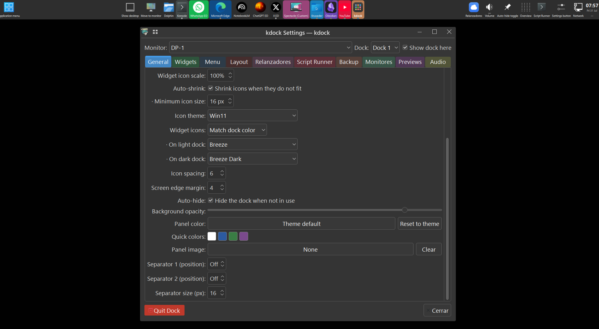

# kdock



*Ejemplo de configuración de Kdock, Kdock visible en borde superior*

**Dock y panel para escritorios Wayland**, escrito 100 % en Qt 6.

[](LICENSE)


kdock **no enlaza contra KDE Frameworks ni contra Plasma**. Los protocolos Wayland se
generan directamente desde sus XML con `qtwaylandscanner`, y todo lo demás se resuelve por
D-Bus o por CLI. El resultado son dos binarios sueltos, sin plugins que instalar y sin
arrastrar medio Plasma como dependencia.

Probado a diario en **KDE Plasma 6 / KWin**; la barra de tareas también funciona en
compositores wlroots (sway, hyprland, wayfire) por `wlr-foreign-toplevel-management-v1`.

---

## Características

### El dock

- **Panel real de compositor** vía `wlr-layer-shell-v1`, con *exclusive zone* (el
  equivalente Wayland de los struts de X11) para que las ventanas maximizadas no lo tapen.
  La integración layer-shell es código propio compilado como plugin estático de Qt Wayland
  (`src/layershell.cpp`); los diálogos y menús se delegan solos a xdg-shell.
- **Barra de tareas** con dos backends elegidos en runtime:
  `org_kde_plasma_window_management` (KWin) y `wlr-foreign-toplevel-management-v1` (wlroots).
- **Lanzadores anclados** desde archivos `.desktop` XDG, parseados a mano, con agrupación de
  ventanas por aplicación (incluidas las **web apps de Chromium/Edge**, que reportan un
  `app_id` deformado y necesitan heurísticas propias).
- **Un dock por monitor**, opt-in: cada uno con su configuración independiente (borde,
  tamaño, widgets, anclados) y manejo de hotplug. Hasta 3 docks por pantalla.
- **Modos de presentación**: flotante o panel de borde a borde, modo compacto, alineación
  inicio/centro/fin, opacidad, color de fondo, largo fijo o automático.
- **Etiquetas de íconos** en seis disposiciones (debajo, al costado, solo nombre…) con
  medición del nombre más largo para que el dock no desperdicie grosor.
- **Auto-encogido**: cuando no entran todos los íconos, el dock reduce escala y fuente en vez
  de recortar.
- **Drag & drop** para reordenar íconos y secciones enteras, con separadores dinámicos
  (*springs*) que empujan el resto hacia el otro extremo.
- **Íconos y colores del sistema**: `QIcon::fromTheme` + esquema de color leído de
  `~/.config/kdeglobals` con recarga en vivo. El fondo de las apps corriendo se tiñe con el
  color dominante del propio ícono.
- **Bandeja del sistema** (StatusNotifierItem + DBusMenu, implementados acá).
- **Panel de configuración** en Qt Widgets, con una solapa por área y cada una teñida de un
  color distinto para ubicarse de un vistazo (es lo que se ve en la captura de arriba).
- **Menú de aplicaciones** estilo Kickoff: categorías XDG, búsqueda, favoritos y pie de
  sesión. Muestra además los **submenús propios**: los que se arman con el editor de menús
  de KDE y los que crean los navegadores para sus web apps — declarados en los archivos
  `.menu` de XDG, que listan sus miembros por nombre de archivo y no por categoría (de
  hecho, los `.desktop` de las web apps no traen `Categories` en absoluto). El clic derecho
  sobre el botón del menú abre el editor de menús, configurable.
- **Vista de lista o de grilla** en el menú, de 1 a 8 columnas, con tamaño de ícono y
  espaciado regulables: las celdas se calculan desde el ícono, así que unas pocas apps no
  se desparraman por todo el popup.

### Widgets

Todos opcionales y reordenables. Los backends hablan D-Bus o CLI directo, nunca KDE
Frameworks:

| Widget | Qué hace | Backend |
|---|---|---|
| Volumen | Sink por defecto: scroll, mute, nivel | `wpctl` / `pactl` (PipeWire) |
| Brillo | Brillo de pantalla | `brightnessctl` |
| Batería | Carga, estado y perfil de energía | UPower + power-profiles-daemon |
| Discos | Unidades extraíbles: montar, desmontar, expulsar, abrir | UDisks2 |
| Red | Conexiones guardadas y switch de Wi-Fi | NetworkManager |
| Portapapeles | Historial de texto con búsqueda, persistente | `QClipboard` |
| Reloj | 12/24 h, fecha, segundos (dos variantes) | — |
| Overview | Abre el efecto Overview de KWin | kglobalaccel |
| Mover ventana | Al siguiente escritorio virtual o al siguiente monitor | kglobalaccel |
| Siguiente fondo | Avanza la presentación de fondos de un monitor | D-Bus de Plasma |
| Sesión | Cerrar sesión, reiniciar, apagar, bloquear, suspender | D-Bus de KDE |
| Mostrar escritorio | Toggle de "mostrar escritorio" | Protocolo del compositor |
| Auto-ocultar | Prende y apaga el auto-ocultado | — |
| Relanzadores | Mini-dock anidado: un ícono despliega una barra con otros lanzadores | — |
| Script Runner | Ejecuta un script shell configurable | `sh` |

### `kdock-previews` (binario accesorio)

Tiras de **vistas previas de ventanas** en un borde de pantalla — una tarjeta por ventana con
una captura real de su contenido, clic para activarla (la referencia es el Stage Manager de
macOS). Es un segundo binario con su propio árbol (`previews/`), su propia configuración y su
propio multimonitor; corre *junto* al dock, que solo lo prende, lo apaga y le abre su panel
desde *Configuración → Previews*. Usa `org.kde.KWin.ScreenShot2`, así que es **solo para
KWin**.

---

## Requisitos

**Para compilar** — solo Qt 6 (≥ 6.5) y CMake/Ninja:

```sh
sudo apt install qt6-base-dev qt6-declarative-dev qt6-wayland-dev \
                 qt6-wayland-private-dev cmake ninja-build
```

Módulos de Qt: Core, Gui, Qml, Quick, Widgets, DBus y WaylandClient (más los headers
privados de WaylandClient, que la integración layer-shell necesita). En runtime hace falta
`QtQuick.Controls`.

**En runtime**, cada dependencia es opcional y solo apaga su widget si falta: `wpctl` o
`pactl` (volumen y mezclador), `brightnessctl` (brillo), UDisks2 (discos), NetworkManager
(red), UPower (batería). Los widgets de Overview, mover-ventana y siguiente-fondo solo
aparecen bajo KDE.

## Compilar e instalar

```sh
cmake -B build -G Ninja -DCMAKE_BUILD_TYPE=Release
cmake --build build -j
sudo cmake --install build     # instala los dos binarios y sus .desktop
```

> Si tu entorno exporta `CC="ccache gcc"` / `CXX="ccache g++"`, CMake AutoMoc falla:
> configurá con `env -u CC -u CXX cmake …`.

## Permisos en KWin (importante)

KWin trata la lista de ventanas y las capturas como **interfaces privilegiadas**, y solo se
las concede a un proceso cuyo `.desktop` **instalado** las declare. Resuelve
`/proc/<pid>/exe` contra el `Exec=` **absoluto** de ese archivo, que por eso lo genera CMake
en tiempo de instalación:

```ini
# kdock.desktop
X-KDE-Wayland-Interfaces=org_kde_plasma_window_management

# kdock-previews.desktop — necesita las dos
X-KDE-Wayland-Interfaces=org_kde_plasma_window_management
X-KDE-DBUS-Restricted-Interfaces=org.kde.KWin.ScreenShot2
```

Después de instalar hay que refrescar el índice para que KWin encuentre los `.desktop`:

```sh
kbuildsycoca6
```

Si ejecutás el binario desde otra ruta (`build/kdock` durante desarrollo), copiá el
`.desktop` a `~/.local/share/applications/` con el `Exec=` apuntando a la ruta absoluta de
*ese* binario. Sin esto el dock arranca igual, pero sin lista de ventanas; y
`kdock-previews`, sin la segunda clave, deja todas las tarjetas con el ícono de la app en vez
de la captura — parece un bug de render y es autorización.

En compositores wlroots no hace falta nada: `zwlr_foreign_toplevel_manager_v1` es público.

## Uso

```sh
kdock
```

- **Clic izquierdo** — lanzar / enfocar / minimizar / ciclar entre ventanas.
- **Clic medio** — nueva instancia.
- **Clic derecho** — menú contextual: lista de ventanas, anclar/desanclar, cerrar, etiquetas,
  color de fondo, agregar separador, configuración.
- **Arrastrar** — reordenar íconos y secciones.

La configuración vive en el directorio de datos XDG:

```
~/.local/share/kdock/
  kdock.conf                  # opciones compartidas (relanzadores, script runners, tema…)
  kdock-<monitor>[-<n>].conf  # un archivo por dock
  previews.conf               # kdock-previews (compartido + uno por pantalla)
  clipboard-history.txt
```

*Configuración → Backup* exporta e importa todo eso como un `.zip`.

## Estructura del repositorio

| Ruta | Qué es |
|---|---|
| `src/` | El dock: backends, modelo, configuración, diálogo de opciones |
| `qml/` | La UI del dock y sus popups |
| `previews/` | Binario accesorio de vistas previas (árbol propio, reusa 5 archivos de `src/`) |
| `protocols/` | Protocolos Wayland vendoreados (layer-shell, foreign-toplevel, plasma-window, xdg-shell) |
| `AGENTS.md` | Documento de arquitectura: cada widget, las trampas de Wayland, la tabla QML↔C++ |
| `CLAUDE.md` | Cómo compilar, probar e instalar; arneses de prueba sin GUI |

## Limitaciones conocidas

- **Wayland es el objetivo.** En X11 el binario corre como ventana normal, sin struts ni
  reserva de espacio.
- **Wi-Fi**: solo se activan conexiones ya guardadas. Unirse a una red nueva escribiendo la
  contraseña necesita un agente de secretos de NetworkManager, que no está implementado.
- **Portapapeles**: en Wayland una app solo puede leer el portapapeles mientras tiene el foco
  del teclado, y la superficie del dock es inerte al teclado. La solución correcta es
  `wlr-data-control-unstable-v1`; todavía no está.
- La integración layer-shell usa headers **privados** de QtWaylandClient (igual que
  layer-shell-qt): una versión mayor nueva de Qt puede pedir ajustes.

## Licencia

MIT — ver [LICENSE](LICENSE).
