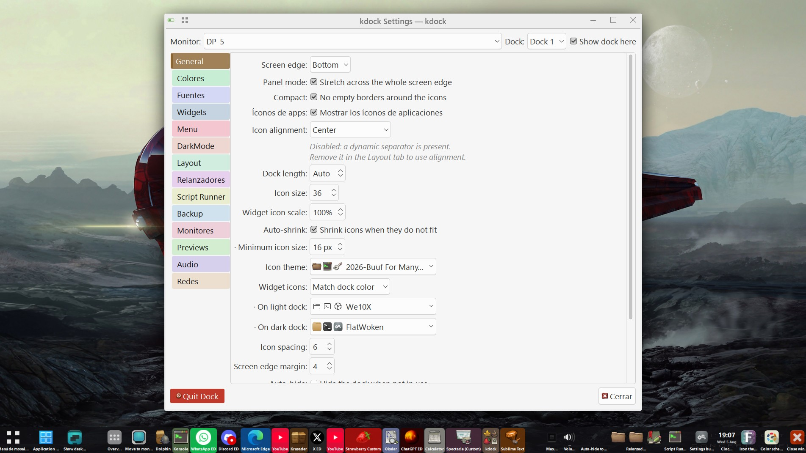
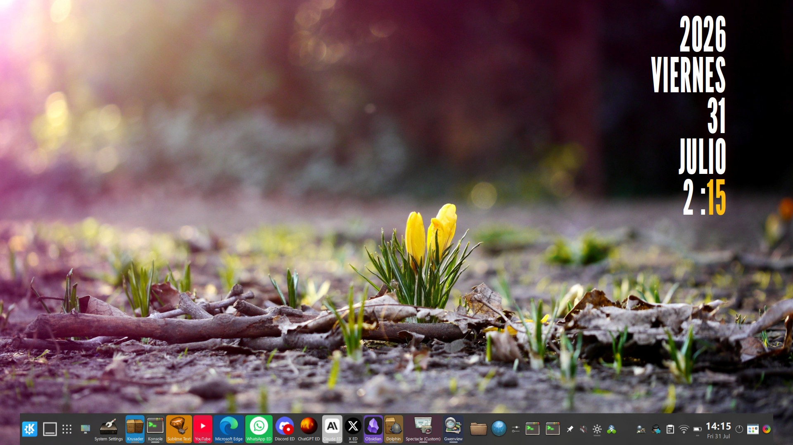
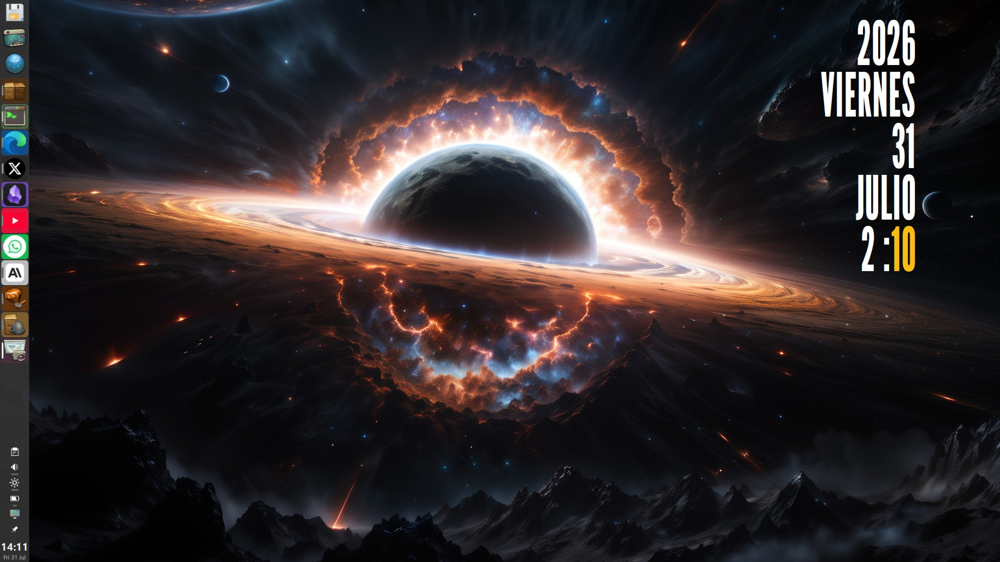
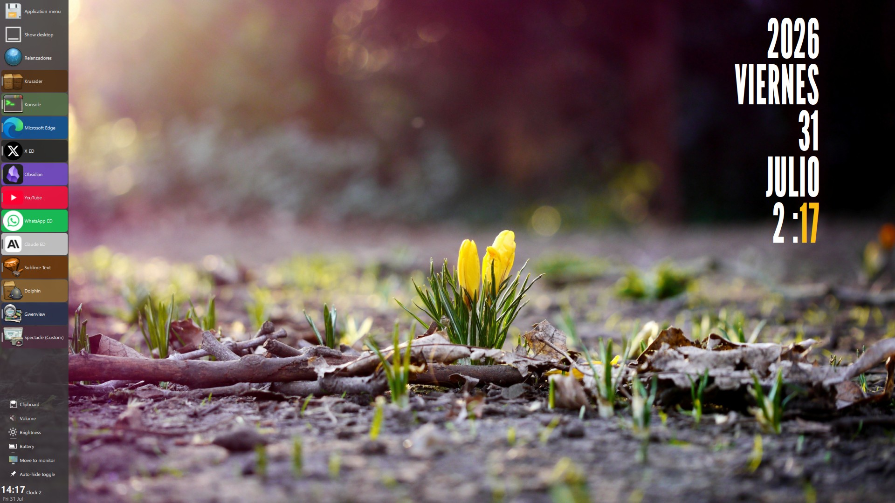
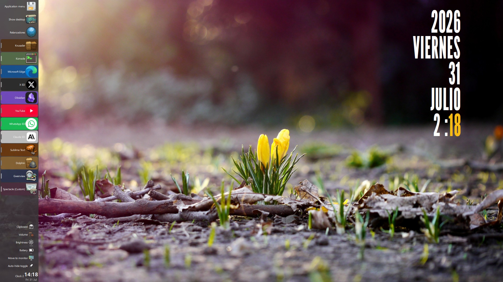
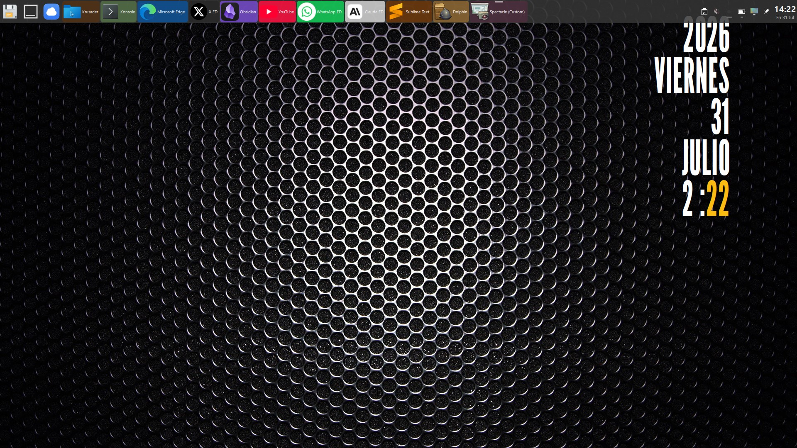
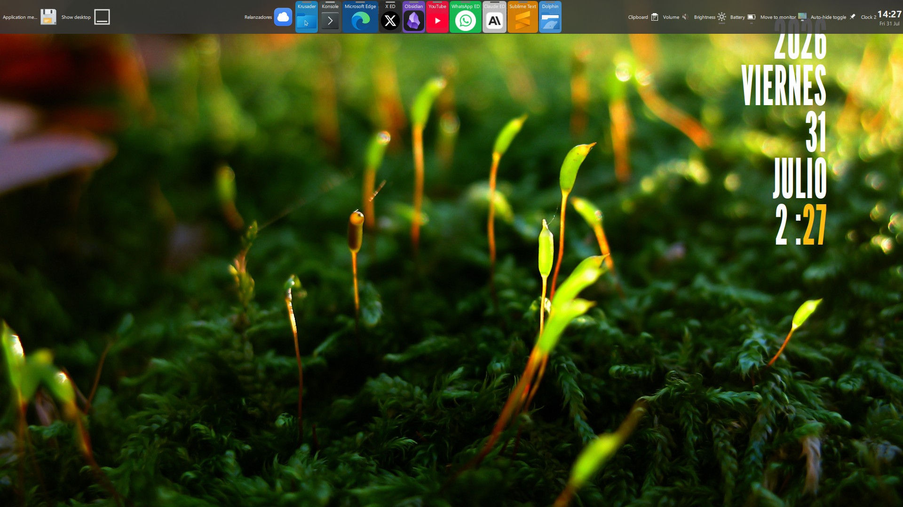

[Español](README.md) | [English](README.en.md) | **中文**

# kdock  ·  RELEASE 0.1.2



*kdock 配置示例*

**面向 Wayland 桌面的 Dock 和面板**，100% 使用 Qt 6 编写。

[](LICENSE)


kdock **不链接 KDE Frameworks，也不链接 Plasma**。Wayland 协议直接从其 XML 用
`qtwaylandscanner` 生成，其余一切都通过 D-Bus 或 CLI 解决。最终得到四个独立的二进制文件，
没有需要安装的插件，也不用拖带半个 Plasma 作为依赖。

在 **KDE Plasma 6 / KWin** 上日常使用测试；任务栏部分在 wlroots 系合成器
（sway、hyprland、wayfire）上也能通过 `wlr-foreign-toplevel-management-v1` 正常工作。

---

## 画廊

Dock 在不同边缘和标签排列方式下的样子：

| | |
|---|---|
| <br>*底部，通栏，标签在图标下方* | <br>*左侧，紧凑模式，仅图标* |
| <br>*左侧，标签在旁边* | <br>*同上，图标/标签顺序反转* |
| <br>*右侧，widget 在下方* | <br>*顶部，标签在旁边* |
| <br>*顶部，紧凑模式，标签在上方* | |

## 特性

### Dock 本身

- **真正的合成器面板**，通过 `wlr-layer-shell-v1` 实现，带 *exclusive zone*（Wayland 中
  相当于 X11 struts 的机制），确保最大化的窗口不会被它遮挡。layer-shell 集成是自研代码，
  编译为 Qt Wayland 的静态插件（`src/layershell.cpp`）；对话框和菜单则自动委托给
  xdg-shell。
- **任务栏**，运行时在两个后端之间选择：
  `org_kde_plasma_window_management`（KWin）和 `wlr-foreign-toplevel-management-v1`
  （wlroots）。
- **固定启动器**，来自手动解析的 XDG `.desktop` 文件，支持按应用分组窗口（包括
  **Chromium/Edge 的 Web 应用**，它们上报的 `app_id` 是变形的，需要专门的启发式规则）。
- **每个显示器一个 Dock**，可选启用：每个都有独立的配置（边缘、大小、widget、固定项）
  和热插拔处理。每屏最多 6 个 Dock。
- **不同虚拟桌面上不同的 Dock**（KDE/KWin）：除了随显示器变化外，一个 Dock 还可以绑定到
  一个或多个虚拟桌面。规则以显示器为单位：在拥有专属 Dock 的桌面上，**只会显示那些
  Dock**；而没有专属 Dock 的显示器则继续显示原来的那些。也就是说，只要你不绑定任何
  Dock，一切照旧：现有的 Dock 会显示在所有虚拟桌面上。可在 *Docks* 中通过勾选桌面或使用
  **为该桌面复制…** 来配置，后者会在同一台显示器上克隆该 Dock，方便开始区分配置。右键菜单
  中的 **Dock → 新建空 Dock** 会在同一台显示器上新增一个使用默认值的 Dock：如果你当前所在
  的桌面已经有专属 Dock，新建的 Dock 会立即绑定到该桌面，从而马上显示出来。同样在右键菜单
  中的 **Dock → 移到下一显示器**，会把 Dock 移动到下一台已连接的显示器（到达最后一台后
  循环回第一台）：配置会随之迁移，旧文件重命名为备份，并在下一次移动时自动清理。
  对话框顶部的**虚拟桌面**选择器和 Dock 的**名称**会随时提示你正在编辑哪一个；从某个 Dock
  打开配置会预先选中它自己。某个虚拟桌面上的 Dock **在你第一次进入该桌面之前不会被构建**
  ——这样就不用为一个可能永远看不到的 Dock 支付内存开销——此后切换虚拟桌面只是显示或
  隐藏它们。
- **每个虚拟桌面不同的壁纸**，这是 Plasma 没有提供的功能：Plasma 的壁纸是按屏幕设置的，
  而不是按桌面设置的。kdock 通过在切换的瞬间重写壁纸来实现这一点。**桌面 1 仍然归 KDE
  管理**：它的配置——幻灯片放映的文件夹、间隔时间，或者你设置的任何内容——会自行保存，
  每次回到桌面 1 时都会还原，kdock 退出时也是如此。桌面 2 到 5 各自拥有**独立的模式**：
  *静态*（每台显示器一张固定图片，使用 KDE 自带的、带预览功能的文件选择对话框）或
  *幻灯片放映*（KDE 的插件，根植于**每台显示器专属的文件夹**，间隔时间可以秒为单位配置，
  默认 5 分钟）。这些模式在**各个桌面之间是互斥的**：一个桌面可以运行幻灯片放映，另一个
  可以显示静态图片。没有分配任何内容的显示器不会被改动。该功能默认**关闭**：只要你不开启
  它，kdock 就不会给你的桌面写入任何一个键。
- **展示模式**：悬浮或通栏面板、紧凑模式、起始/居中/末尾对齐、透明度、背景色、固定长度或
  自动长度。
- **快速配色**：八种可配置的背景色，可从右键菜单的*背景色*子菜单实时应用。调色板对**所有
  Dock 通用**，保存在共享配置中，因此只需编辑一次，重启后依然保留；而具体选中的颜色则是
  每个 Dock 各自独立的。
- **图标标签**，六种排列方式（下方、旁边、仅名称……），会测量最长名称的宽度，避免 Dock
  浪费厚度。可选**加粗**，并会重新测量以确保最宽的名称仍然能容纳。
- **名称双行显示**（可选）：一个比其容器更长的名称会**换行**而不是用省略号截断，从而完整
  可读——例如 *某个很长的应用程序名称* 而不是 *某个很长的应用程序…*。这对应用名称和
  widget 名称都适用，且 Dock 的厚度会随之变化：容器高度变为两倍行高，layer-shell 的
  *exclusive zone* 也会重新计算，确保最大化的窗口不被遮挡。
- **暗色模式**，可按 Dock 单独切换，或一次性对所有 Dock 生效并配置例外列表：暗色背景、
  名称和正在运行的应用统一使用一种高亮颜色，widget 图标解析为暗色图标集。这是一种
  **覆盖**，而不是重写：原有的配色方案在 `.conf` 中保持不变，回到正常模式时原样恢复。
  可以从其专属选项卡、右键菜单的*模式*子菜单或它自己的 widget 切换。可选地一并带走
  **KDE 的配色方案和图标集**以及 Dock 自身的图标集：由于这确实属于桌面状态，且无法
  "取消应用"，每个选项都会保存两种模式各自的值。
- **自动收缩**：当图标放不下时，Dock 会缩小比例和字体，而不是裁切内容。
- **拖放**，用于重新排序图标和整个分区。
- **五种分隔符**，画法各不相同。分区之间的三种，从任意小部件的右键菜单添加：**动态**分隔符
  （*spring*）会伸展并把其余内容推向另一端；**静态**分隔符是一段固定的间隔，中间有一条细线；
  **透明**分隔符则会同时在 Dock 背景和它的输入区域上挖洞——中间能看到桌面，点击也会穿过去，
  于是一个 Dock 看起来像两个。此外**在应用程序区域内部**还有最多两个（*Layout* 标签页），
  用来把固定的启动器彼此分开、并与仅在运行的窗口分开：每一个都可以是一条线，或者是
  **透明**的，也就是一段没有线条的空白，背后的 Dock 背景照旧绘制。
- **将窗口发送到另一个虚拟桌面**，通过应用图标的右键菜单：*桌面 → 窗口到此处* 会把它带到
  当前桌面，而*发送到…*会将其发送到另一个桌面**且不跟随**——你留在原地。这个操作会移动该
  应用的所有窗口，就像*关闭全部*一样。
- **系统图标和配色**：`QIcon::fromTheme` + 从 `~/.config/kdeglobals` 读取的配色方案，支持
  实时重新加载。正在运行的应用的背景色会根据其自身图标的主色调进行染色。
- **单一主题选择器**，Dock 和配置界面共用：在一个完整的安装中大约有 180 个图标集和 450 个
  配色方案，所以每个选择器都不是简单的下拉框，而是打开一个**带搜索和预览**的列表——三个
  用*该*图标集渲染的示例图标，或配色方案的三种颜色样本。每一行都有一个**收藏**复选框，勾选
  后会置顶；收藏列表是所有 Dock 和配置对话框**共用的单一列表**。还有一个**"保持打开"**
  复选框，方便连续尝试多个主题，而不用每次都重新打开窗口。
- **系统托盘**（StatusNotifierItem + DBusMenu，均为自研实现）。可以放在你选择的任意 Dock
  上——不限于主 Dock——但同一时刻只能有一个 Dock 拥有它：两个同时可见的托盘会让每个图标
  重复出现。而永远不会同时出现的 Dock 则可以各自拥有自己的托盘，这样一个拥有专属 Dock 的
  虚拟桌面就不会缺少托盘。
- **纯 widget Dock**：关闭应用图标（常规 → *应用图标*）后，Dock 就变成一个只有 widget、
  托盘和固定项的工具条，并按剩余内容自动瘦身。
- **全局提示气泡**：*常规*选项卡中的一个复选框可以一次性打开或关闭所有 Dock 的所有
  提示气泡，避免在不需要时为这些窗口付出开销。
- **配置面板**，用 Qt Widgets 编写，每个区域一个选项卡，每个选项卡染上不同颜色便于一眼
  区分（就是上方截图里看到的样子）。*Docks* 选项卡列出所有已配置的 Dock——每个都标明其
  显示器、边缘和所属虚拟桌面——并支持双击重命名；别名会附加在自动生成的名称后面，因此
  显示器信息不会丢失。默认隐藏未连接的 Dock 和显示器，有复选框可以重新显示它们。
- **应用菜单**，Kickoff 风格：XDG 分类、搜索、收藏和会话操作底栏。同时展示**自定义子菜单**：
  用 KDE 菜单编辑器创建的子菜单，以及浏览器为其 Web 应用创建的子菜单——它们在 XDG 的
  `.menu` 文件中声明，按文件名而非分类列出成员（事实上，Web 应用的 `.desktop` 文件根本
  不带 `Categories`）。点击菜单按钮的右键会打开菜单编辑器，可自行配置。**侧边栏的所有行都
  带图标**，无论是 freedesktop 标准分类还是自定义子菜单，并为所选图标集缺失标准名称的情况
  提供了备用方案。
- **列表或网格视图**，菜单中可选 1 到 8 列，图标大小和间距均可调节：单元格根据图标大小
  计算，因此少量应用不会在整个弹出窗口中显得过于分散。

#### 可翻译的界面，基于纯文本文件

代码中书写的文本是**原生层，即 "capabase"**。在其之上加载一层翻译：一个位于
`~/.local/share/kdock/translations/` 的纯文本 `.md` 文件，可以从配置面板的*翻译*
选项卡中选择和编辑（点击**编辑**按钮 → 用你默认的文本编辑器打开；保存后 Dock 会自动
读取更改，无需重启）。自带**西班牙语**、**英语**和**简体中文（zh-CN）**，未来会陆续
添加更多语言。

每个文件包含四个标题：

| 标题 | 翻译的内容 | 键 |
|---|---|---|
| `Configuracion` | 配置面板 | capabase 文本 |
| `UIdock` | Dock 的菜单、提示气泡和弹出窗口 | capabase 文本 |
| `Widgets` | widget 的名称 | widget 的 token（`clock`、`pager`……） |
| `Apps` | 应用的名称 | `.desktop` 的 id |

翻译文件中未包含的内容会回退到 capabase 的文本——对于应用来说，会回退到其 `.desktop` 的
`Name=`——因此一个不完整的文件完全有效：翻译你想翻译的部分，其余照常工作。手动**重命名过**
的 widget 会在所有语言下保留该名称。*更新应用*按钮会用所有已安装的应用填充 `Apps`
部分，随时可以重命名；*新建…*会复制一份翻译文件作为起点：添加一门新语言只需要这些，
无需重新编译。

中文需要安装 CJK 字体（Noto Sans CJK 或文泉驿）；没有它，系统会显示方块字符，这不是
kdock 能解决的问题。

此外还提供九个 **ALT** 层，将名称替换为别名：三套——`*-ALT-startrek`（星际迷航的飞船）、
`*-ALT-hacker`（黑客化名）和 `*-ALT-starwars`（星球大战的硬件）用于 widget——分别对应三种
基础语言 `english-`、`spanish-` 和 `zh-CN-`。九个层共享 `Apps` 部分相同的分配方案：
科幻小说中的人工智能和虚构的黑客工具。在英语和西班牙语中，这些别名是专有名词，保持原样；
**在中文中它们也被翻译**（冬寂 Wintermute、企业号 Enterprise、匡氏十一型 Kuang Mark
Eleven），这样这个玩笑才能用界面所使用的语言来表达。它们同时也是四个部分的完整示例——
尤其是 `Apps`，这是唯一一个用真实 `.desktop` id 填充的部分。

| | Star Trek | Hacker | Star Wars |
|---|---|---|---|
| 磁盘 | Reliant · 可靠号 | Phantom Phreak · 幽灵飞客 | Astromech · 宇航技工机 |
| 网络 | Excelsior · 卓越号 | Phiber Optik · 光纤客 | Comlink · 通讯器 |
| 音量 | Intrepid · 无惧号 | Blade · 利刃 | Sonic Emitter · 声波发射器 |
| 暗色模式 | Equinox · 春分号 | Nightfall · 夜幕 | Carbonite · 碳素冷冻 |

在 `Apps` 部分，九个层中都相同：Dolphin 是 *Wintermute*（冬寂），Konsole 是
*Mycroft Holmes*（迈克罗夫特），Edge 是 *Kuang Mark Eleven*（匡氏十一型）——出自
*神经漫游者* 中的破冰船——Wireshark 是 *Packet Ripper*（数据包撕裂者）。总共提供**十三个
层**：capabase、三种基础语言，以及九个 ALT 层。

### Widget

全部可选，均可重新排序。后端全部通过 D-Bus 或直接调用 CLI，绝不依赖 KDE Frameworks：

| Widget | 功能 | 后端 |
|---|---|---|
| 音量 | 默认 sink：滚轮调节、静音、音量显示 | `wpctl` / `pactl`（PipeWire） |
| 亮度 | 屏幕亮度 | `brightnessctl` |
| 电池 | 电量、状态和电源配置文件 | UPower + power-profiles-daemon |
| 磁盘 | 可移动设备：挂载、卸载、弹出、打开 | UDisks2 |
| 网络 | 附近 Wi-Fi 网络（带密码连接）、已保存的连接、Wi-Fi 开关；右键打开网络编辑器 | NetworkManager |
| 剪贴板 | 文本和图片历史记录，支持搜索，持久化，后台捕获 | `ext-data-control-v1` |
| KDE 图标集 | 切换整个桌面的图标集，保持 Dock 自身的图标集不变 | `plasma-changeicons` |
| 配色方案 | 将 KDE 配色方案应用到整个桌面 | `plasma-apply-colorscheme` |
| 时钟 | 12/24 小时制、日期、秒（两种样式） | — |
| Overview | 打开 KWin 的 Overview 效果 | kglobalaccel |
| 移动窗口 | 移到下一虚拟桌面，或下一显示器（右键：移到上一个） | kglobalaccel |
| MaxMin | 最大化（左键）或最小化（右键）当前活动窗口 | kglobalaccel |
| 关闭窗口 | 关闭当前活动窗口；右键将其发送到下一虚拟桌面而不切换桌面 | 合成器协议 + KWin（D-Bus） |
| 下一张壁纸 | 推进某台显示器的壁纸幻灯片放映 | Plasma 的 D-Bus |
| 会话 | 注销、重启、关机、锁屏、挂起 | KDE 的 D-Bus |
| 显示桌面 | 切换"显示桌面" | 合成器协议 |
| 虚拟桌面 | 极简分页器：每个虚拟桌面一个数字，点击即可切换；当前桌面高亮显示 | KWin（D-Bus） |
| 自动隐藏 | 开关自动隐藏功能 | — |
| 暗色模式 | 左键：正常配色；右键：暗色模式 | — |
| 子启动器 | 嵌套小型 Dock：一个图标展开一个包含其他启动器的工具条 | — |
| Script Runner | 执行可配置的 shell 脚本 | `sh` |
| 磁贴菜单 | 打开和关闭全屏磁贴菜单 | `kdock-tilemenu`（D-Bus） |

### `kdock-previews`（配套二进制文件）

屏幕边缘的**窗口预览条**——每个窗口一张卡片，展示其内容的真实截图，点击即可激活（参考对象
是 macOS 的 Stage Manager）。这是第二个独立的二进制文件，拥有自己的源码树
（`previews/`）、自己的配置、自己的多显示器支持；与 Dock 一起运行，Dock 只负责启动它、
关闭它，以及从*配置 → Previews* 打开它的面板。使用 `org.kde.KWin.ScreenShot2`，因此
**仅支持 KWin**。

- **点击卡片** = 类似任务栏的焦点切换：恢复并聚焦该窗口，若再次点击已经在前台的窗口则将其
  最小化。中键点击 = 关闭。
- **卡片自动调整大小**：窗口较多时卡片会自动缩小以适应预览条的长度，而不是溢出滚动，关闭
  部分窗口后会恢复到配置的大小（可调节的最小尺寸）。**预览条的厚度会跟随卡片变化**：卡片
  缩小时预览条也随之变薄，卡片增多时恢复原尺寸，因此缩略图始终填满整条预览条，两侧不留
  空白（预留给桌面的区域也随之调整）。
- **滚动浏览**：鼠标滚轮、带惯性的拖动和经过精细调校的 *fling* 手势，让在大量卡片间移动
  毫不费力，边缘内侧还可选启用一条细滚动条。
- **尺寸和位置**：可放在四个边缘中的任意一个，厚度可调，范围 48 到 800 px（面板中根据
  边缘称之为*高度*或*宽度*），长度可固定或占满整条边缘，对齐方式为起始/居中/末尾——若预览条
  有自己的长度，则移动整条预览条；若占满整条边缘，则移动条内的卡片。
- 捕获方式为**窗口切换到前台时各拍一次**（或周期性刷新，实验性功能），可按显示器/虚拟
  桌面/最小化窗口过滤，并可选自动隐藏。

### `kdock-tilemenu`（配套二进制文件）

**全屏应用磁贴菜单**，图标排列在矩阵中，可通过拖动重新排列（参考对象是 Plasma 的 Tiled
Menu 小程序，名字也由此而来）。这是第三个独立的二进制文件，拥有自己的源码树
（`tilemenu/`）、自己的配置和自己的面板；由 Dock 上的*磁贴菜单* widget 负责启动和关闭。

占据**所有空闲的桌面区域：除已可见的 Dock 和面板外的一切**，不论它们位于哪个边缘、是
什么类型。实现这一点不需要一行几何计算代码——这个窗口就是一个普通的、*最大化*的顶层窗口，
合成器早已知道要扣除面板预留的空间。带自动隐藏功能的 Dock 也能顺带得到同样的效果：菜单
覆盖整个屏幕，Dock 出现时会绘制在它上面。

- **每个分区都会记住自己的布局**——收藏夹、"全部"、每个分类以及每个 `.menu` 子菜单。
  它们最初按名称自动排序，一旦你拖动第一个磁贴，就变成你自己的排列方式。这正是它与参考
  小程序的区别，后者只有固定项画布可以手动排列。
- **多种尺寸的磁贴**（1×1、2×1、1×2、2×2、4×2、4×4），每个都可设置自己的颜色或背景图片，
  图标和名称可分别选择是否显示——还可以在不修改 `.desktop` 文件的情况下重命名或更换图标。
  名称默认加粗，可在面板中切换。
- **分组以选项卡形式呈现**：每个分区都可以拆分为带名称的分组，以选项卡形式显示在上方、
  下方或一侧（可选），且仅在有多于一个分组时才出现。将磁贴**拖到某个选项卡上**，或通过
  其右键菜单 → *移到分组*，即可将它移到另一个分组，后者还提供以该磁贴为起点新建分组的
  选项。配置面板提供分组编辑器——每次编辑一个分区——用于创建、重命名、排序和删除分组。
- **释放时不会发生意外**：如果目标单元格是空的，磁贴就移过去；如果被同尺寸的磁贴占据，
  两者互换；其他任何情况都会被拒绝，磁贴回到原位。不会因为你移动了某个相邻磁贴而导致
  其他内容自动重排，一个彩色的幻影会在你释放之前提示你面对的是这三种情况中的哪一种。
- **搜索框**、侧边**字母索引**（在未手动排列的分区中）、位于左侧或右侧、也可隐藏的分类
  栏——所有行都带图标——会话操作行，以及键盘导航。
- **保持打开**：角落里的一个复选框会关闭四条自动关闭路径（Esc、✕ 按钮、失去焦点、启动
  一个应用）。勾选后菜单就像普通窗口一样，可以被切换到后台，再通过 alt-tab 找回。
- 布局是**整个会话通用的一份**——所有 Dock 打开的都是同一个菜单——可以导出和导入为 JSON。

在 widget 首次点击时启动并常驻，因此之后再打开就是瞬间完成的。与 `kdock-previews`
不同，**不需要任何 KWin 特殊权限**。

### `kdock-calendar`（配套二进制文件）

**独立的月历**，设计为从时钟 widget 打开（时钟的点击可以指向这个二进制文件，再次点击即
关闭），也可以从 Script Runner 打开。时钟 widget 本身不受影响：这是一个独立的普通顶层
窗口，没有自己的配置。

- **KDE 风格的大号数字**：**周一为一周首日**，本地日期格式，**当天**用带强调色的胶囊
  高亮显示，选中日期带圆环，其他月份的日期/周末则做淡化处理。7×6 的网格占满所有可用
  空间，数字随单元格缩放，因此在较大的窗口中也能良好显示。
- **纯手绘的 Qt Widgets**（不使用 QML 或 KDE Frameworks）：使用系统调色板，因此会自动
  跟随明暗主题和 KDE 强调色。
- **导航方式**：标题栏中的 ‹ › 箭头、鼠标滚轮、`PageUp`/`PageDown`，以及**今天**按钮用于
  返回当前月份。底部显示所选日期的完整日期格式。
- **`kdock-calendar --month YYYY-MM`** 可以启动到指定月份（默认是当前月份）。
- 与 `kdock-tilemenu` 一样，**不需要任何 KWin 特殊权限**：可以直接从 `build/` 目录运行，
  它的 `.desktop` 文件只用于在任务管理器中提供名称和图标。


---

## 依赖要求

**编译时**——只需要 Qt 6（≥ 6.5）和 CMake/Ninja：

```sh
sudo apt install qt6-base-dev qt6-declarative-dev qt6-wayland-dev \
                 qt6-wayland-private-dev cmake ninja-build
```

Qt 模块：Core、Gui、Qml、Quick、Widgets、DBus 和 WaylandClient（还需要
WaylandClient 的私有头文件，这是 layer-shell 集成所必需的）。运行时需要
`QtQuick.Controls`。

**运行时**，每个依赖都是可选的，缺失时只会关闭对应的 widget：`wpctl` 或 `pactl`
（音量和混音器）、`brightnessctl`（亮度）、UDisks2（磁盘）、NetworkManager（网络）、
UPower（电池）。Overview、移动窗口和下一张壁纸这几个 widget 只在 KDE 下出现。

## 编译与安装

```sh
cmake -B build -G Ninja -DCMAKE_BUILD_TYPE=Release
cmake --build build -j
sudo cmake --install build     # 安装四个二进制文件及其 .desktop 文件
```

> 如果你的环境导出了 `CC="ccache gcc"` / `CXX="ccache g++"`，CMake 的 AutoMoc 会失败：
> 请用 `env -u CC -u CXX cmake …` 来配置。

## KWin 权限（重要）

KWin 将窗口列表和截图视为**特权接口**，只授予给一个进程，前提是它**已安装**的
`.desktop` 文件声明了这些权限。KWin 会将 `/proc/<pid>/exe` 与该文件中**绝对路径**的
`Exec=` 进行比对，因此这个字段是 CMake 在安装时生成的：

```ini
# kdock.desktop
X-KDE-Wayland-Interfaces=org_kde_plasma_window_management

# kdock-previews.desktop — necesita las dos
X-KDE-Wayland-Interfaces=org_kde_plasma_window_management
X-KDE-DBUS-Restricted-Interfaces=org.kde.KWin.ScreenShot2
```

安装完成后需要刷新索引，KWin 才能找到这些 `.desktop` 文件：

```sh
kbuildsycoca6
```

`kdock-tilemenu` 不在此列，因为它不需要任何特权：可以从任意位置运行，不需要
`.desktop` 文件，也不需要刷新索引。**`kdock-calendar`** 同理。

如果你从其他路径运行前两者中的某一个（开发阶段的 `build/kdock`），把 `.desktop` 文件
复制到 `~/.local/share/applications/`，并将 `Exec=` 指向*那个*二进制文件的绝对路径。
没有这一步，Dock 依然能启动，只是没有窗口列表；而 `kdock-previews` 如果缺少第二个键，
所有卡片都会显示应用图标而不是截图——看起来像渲染 bug，实际上是权限问题。

在 wlroots 系合成器上什么都不需要：`zwlr_foreign_toplevel_manager_v1` 是公开接口。

## 用法

```sh
kdock
```

- **左键点击** —— 启动 / 聚焦 / 最小化 / 在窗口间循环切换。
- **中键点击** —— 新建一个实例。
- **右键点击** —— 上下文菜单：窗口列表、固定/取消固定、关闭、标签、背景色、添加分隔符、
  配置。每一项都带有图标，**包括子菜单的标题行**（*桌面*、*位置*、*背景色*、*模式*、
  *应用文字*、*小部件文字*、*Dock*）。
- **拖动** —— 重新排序图标和分区。

在 widget 上，右键点击会打开同样的菜单，除非该 widget 用右键实现了第二种操作（音量 →
混音器，移到显示器 → 上一台显示器，MaxMin → 最小化，关闭窗口 → 发送到下一虚拟桌面）。
在所有情况下，**Shift + 右键点击**都会打开该菜单。

配置文件位于 XDG 数据目录：

```
~/.local/share/kdock/
  kdock.conf                  # 共享选项（子启动器、Script Runner、主题、
                              #   图标集和配色方案的收藏……）
  kdock-<monitor>[-<n>].conf  # 每个 Dock 一个文件
  previews.conf               # kdock-previews（共享配置 + 每屏一份）
  tilemenu.conf               # kdock-tilemenu：选项和磁贴布局
  clipboard-history.txt
```

*配置 → 备份* 可以将上述所有内容导出/导入为一个 `.zip`。

## 性能基线（RELEASE 0.1）

Dock 在启动当前桌面所需的一套 Dock 时，RSS 约为 240 MB；每个额外的虚拟桌面在首次进入
时（延迟构建）会增加约 57 MB，此后 RSS 保持平稳——切换虚拟桌面只是显示和隐藏，从不
创建或销毁。

**弹出窗口和提示气泡。** 每个带 `popupType: Popup.Window` 的 `ToolTip`、`Menu` 和
`Popup` 都会打开自己的 `QQuickWindow`，配有独占的 `QSGRenderThread`，以及每个 GL 上下文
两个 Mesa 驱动线程。QtQuick.Controls 在它们关闭后并不会释放这些资源，因此在一个持续数小时
、拥有六个 Dock 的会话中，进程会累积 **68 个渲染线程 + 136 个 Mesa 线程**，以及
**571 MB 的堆内存**，且没有上限。从这个版本开始：

- **点击类弹出窗口**（应用菜单、剪贴板、磁盘、网络和主题选择器）改为按需通过
  `Loader { active: false }` 加载，并在**闲置 30 秒后**自动销毁，采用的模式在 `tilemenu/`
  中已验证。

- **提示气泡**仍按元素独立创建（原有行为）：曾经尝试并放弃了让它们共享同一窗口实例的
  附加 API 方案，因为那样会把提示气泡定位在鼠标光标处（在水平 Dock 上会闪烁），且没有
  合适的 parent 时会在垂直 Dock 中被最大化窗口遮挡。作为替代，新增了一个**全局提示气泡
  开关**（*配置 → 常规 → 提示气泡*），如果它们造成困扰，或用户不想为此付出内存开销，
  可以直接整体关闭。

改进版时钟的 `ToolTip` 保留了它自定义的外观（自有 contentItem）。

| | 之前（11 小时 / 6 个 Dock） | 之后 |
|---|---|---|
| `QSGRenderThread` | 68 | 约 4-6（每个可见 Dock 窗口一个） |
| Mesa 线程 | 136 | 约 8-12 |
| 堆内存 | 571 MB | 约 180 MB（估算） |
| i915 缓冲区 | 529 MB | 约 120 MB（估算） |

## 仓库结构

| 路径 | 说明 |
|---|---|
| `src/` | Dock 本体：后端、模型、配置、选项对话框 |
| `qml/` | Dock 的 UI 及其弹出窗口 |
| `previews/` | 预览配套二进制文件（独立源码树，复用 `src/` 中的 5 个文件） |
| `tilemenu/` | 磁贴菜单配套二进制文件（独立源码树，复用 `src/` 中的 8 个文件） |
| `calendar/` | 月历配套二进制文件（独立源码树，完全自包含） |
| `protocols/` | 内置的 Wayland 协议（layer-shell、foreign-toplevel、plasma-window、xdg-shell） |
| `translations/` | 翻译层（`capabase.md` + 每种语言一个 `.md`）。首次启动时复制到 home 目录，并在那里编辑 |
| `tools/` | `gen-capabase.py`（从代码重新生成 `capabase.md`）、`sync-translations.py`（将新增的键传播到其他语言）以及 `gen-alt-layers.py`（重新生成九个 ALT 层） |
| `screenshots/` | README 中使用的截图。`.gitignore` 有意忽略了 `*.jpg`/`*.png`（桌面截图可能泄露过多信息）：这里的图片是逐张审核后用 `git add -f` 添加的 |
| `AGENTS.md` | 架构文档：每个 widget、Wayland 相关的坑、QML↔C++ 对照表 |
| `CLAUDE.md` | 如何编译、测试和安装；无 GUI 的测试工具 |

## 已知限制

- **目标平台是 Wayland。** 在 X11 上，这个二进制文件以普通窗口方式运行，没有 struts，
  也不会预留空间。
- **Wi-Fi 企业级认证（802.1X/EAP）**：网络编辑器支持 WPA/WPA2/WPA3-Personal、开放网络和
  WEP。带 802.1X 的连接会显示出来，但无法从这里保存。
- **剪贴板**：保存文本和图片。其他格式（文件、富文本 HTML）不支持。
- **预留空间不是按虚拟桌面区分的。** KWin 是按显示器而不是按桌面计算最大化区域的，因此
  如果两个虚拟桌面上的 Dock 预留了不同的空间（不同的边缘、不同的厚度），切换虚拟桌面时
  所有桌面上已最大化的窗口都会重新调整。kdock 对此做了修正：每次切换后，会对之前已经
  最大化的窗口重新执行最大化操作（带分级重试），因此即使 Dock 厚度不同，它们也能恢复
  正确的大小。可以通过配置 → 常规中的复选框关闭此行为，或设置
  `KDOCK_NO_WINDOW_ACTIONS=1`。
- **按桌面设置壁纸**：可配置的是桌面 2 到 5（桌面 1 归 KDE 管理）；从桌面 6 开始 kdock
  不做任何处理。回到桌面 1 时，如果之前设置了幻灯片放映，它会带着原有配置恢复，但
  **会显示下一张图片**——重新加载会使其前进一张，而幻灯片放映本身也会自行前进。
- **翻译**：Dock 本体、它的配置面板，以及 `kdock-previews` 和 `kdock-tilemenu` 的面板都会
  跟随所选语言。`kdock-calendar` 是例外：由于它完全自包含（不使用 `src/` 中的任何文件），
  仍然停留在 capabase。
- layer-shell 集成使用了 QtWaylandClient 的**私有**头文件（与 layer-shell-qt 相同）：
  Qt 的新大版本可能需要相应调整。

## 许可证

MIT —— 见 [LICENSE](LICENSE)。
